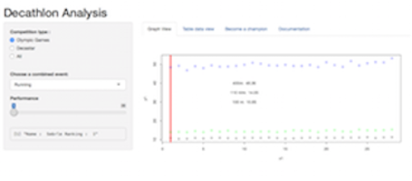
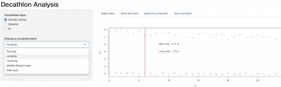

Decathlon Analyzes
========================================================

_**Coursera**_  Developing Data Products
Application Presentation

The main purpose of this application is to show the differents results for Decathlon Olympic Games (Athena 23-24 Aguste in 2004) et Decarstar (2004 25-26 of setpember).
The orignal data come from  [Sebastien ledien's websit (Book Statistiques avec R (Statistics with R)](http://sebastien.ledien.free.fr/unofficial_factominer/livreR/decathlon.csv).

- It is a very simple application, you can test with the link below :
[Decathlon Analyzes : shinyapps.io](https://david4238.shinyapps.io/shiny).
- The R code source is located on the following Githup repo :
[Decathlon Analyzes App: Github](https://github.com/david4238/Data_prodcuts)

The application is build with the folling control widgets:
- 3 radio buttons,  1 select box
- 1 sliders, - 4 tabsets (graphic, dataset query, mean performance, documentation's link)

#GUI Interface
#### The picture below shows the Graphic User Interface of the application.
  

1. The Radio Buttons offers the possibilty of choosing between Olympic Games, Decastar or both.  
2. With the select box, it is possible to choose the diiférents categoy (as show below) :  
* Running : 100 m, 110 m/Hurdles, 400 m, 
* Jumping : High Jump, Long Jump
* Throwing : Javelin Throw,Discus Throw, Shot Throw
* Pole vault, 
* Middle Distance Race (1500 metres)

#Slider and Gragh
The slider give you the possbility to nagivate on the graph (on the right hand side) and see the athlete's performance. The curent position is representing by the vertical red line. the sidebar panel shows the name of the athlete with his ranking position.
The picture below, show the athlete's performance for Jumping ( High Jump, Long Jump).

 

#The others tabset 

1- The Tabset "Table data view" give the possiblity to make dynamy query (keyword search, changing the order) like a database query tool.  
2- "**Become a champion**" is compute the mean of the three best athetes and put on the screen the best results in order to be on the podium. It is possible to select  of course the comptition and the differentes discipline.  
4- The last "tabset" is a simple link to see this current docuementation from the Shinyapp.  

>Enjoy and sorry for my english :-)

